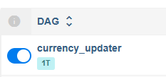

# Установка проекта через Docker

## 1. Скачайте данный репозиторий в удобную папку
`git clone https://github.com/MichaelODeli/1T-DE_final`

## 2. Введите свой API-ключ
Вам необходимо перейти по [данной](https://www.alphavantage.co/support/#api-key) ссылке и получить свой ключ.   
Далее, перейдите по пути `dags/project_settings.py` и поместите свой API ключ в соответствующий параметр (`params_apikey`)

## 3. Запустите проект через docker-compose
`docker-compose up`
> Если Вы используете Docker на Windows, то Вам не рекомендуется использовать подсистему WSL2 из-за некорректной работы контейнеров.

## 4. Перейдите в админ-панель Airflow
`http://localhost:8080/home`
### 4.1. Активируйте DAG **currency_updater**

### 4.2. Если активировать не удается:
- При ошибке импорта DAG-а, повторите попытку через 30 секунд (когда произойдет обновление DAG-ов)

## 5. Проверьте результаты в БД PostgreSQL
- host: `localhost`
- port: `2345`
- user: `postgres`
- password: `postgres`
- db: `currency_dwh`

