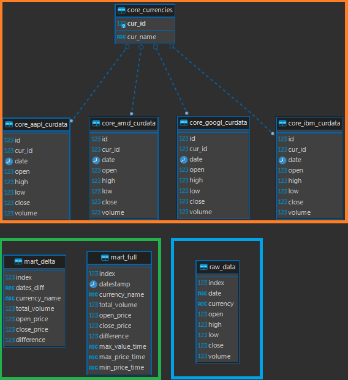

# 1T-DE_final
Платформа 1T. Направление обучения DE. Итоговый проект.

# Использованные инструменты:
- **Apache Airflow** - автоматизация
- **Python** - создание и обновление таблиц
- **PostgreSQL** - СУБД
- **draw.io** - построение схем

# Источник данных
В качестве источника данных по курсам, был использован бесплатный API [alphavantage.co](alphavantage.co).  
Качество данных достаточно приемлемое и дополнительной обработки данных удалось избежать.  
Данные поставлялись в JSON-формате с правильным типом данных. 

# Инструкция по нативному использованию проекта
Размещена [здесь](INSTALLATION.md).

# Инструкция по установке проекта в Docker
Размещена [здесь](DOCKER_INSTRUCTION.md).

# Структура проекта

## Таблицы в БД
> В core-слое присутствуют данные для тех акций, которые указаны в [текущем](project_settings.py) конфигурационном файле.

### Данные в таблицах mart-слоя
Дельта данных:   

Анализ полного слепка данных:   

# Презентация проекта
Доступна в [данном](About_project.pptx) файле.